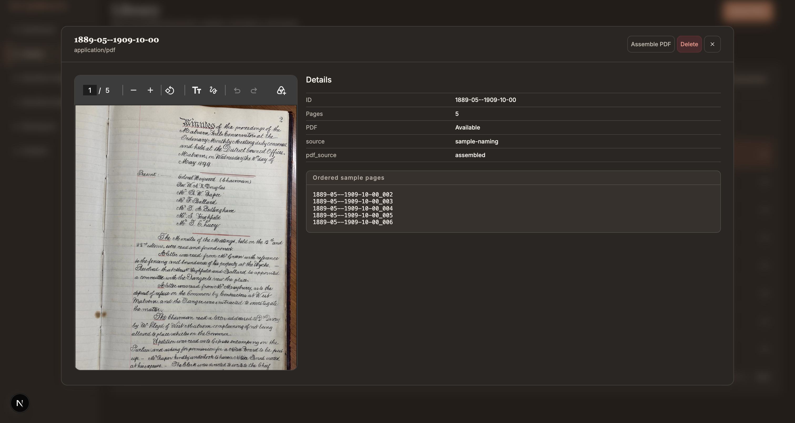
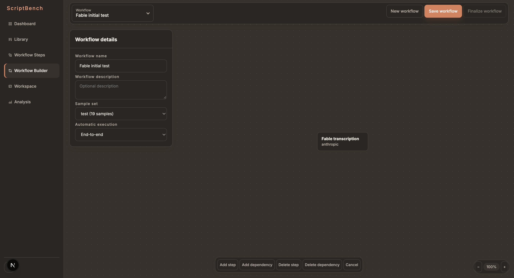
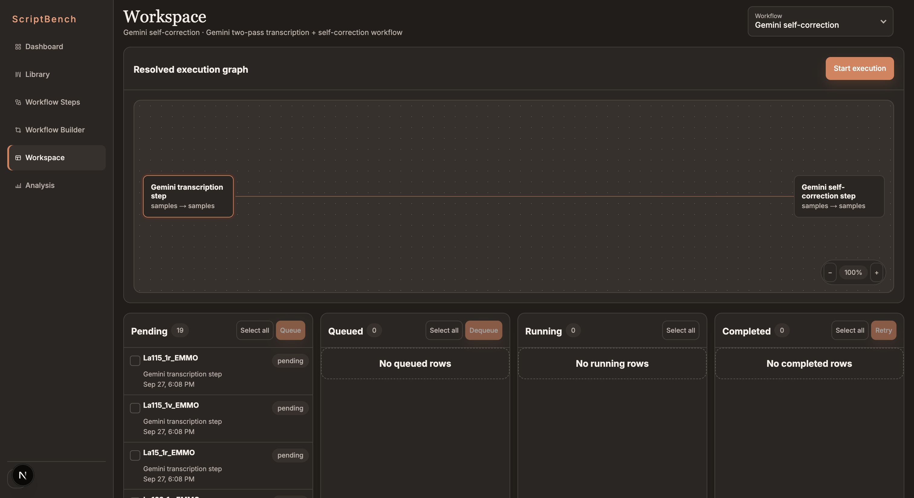
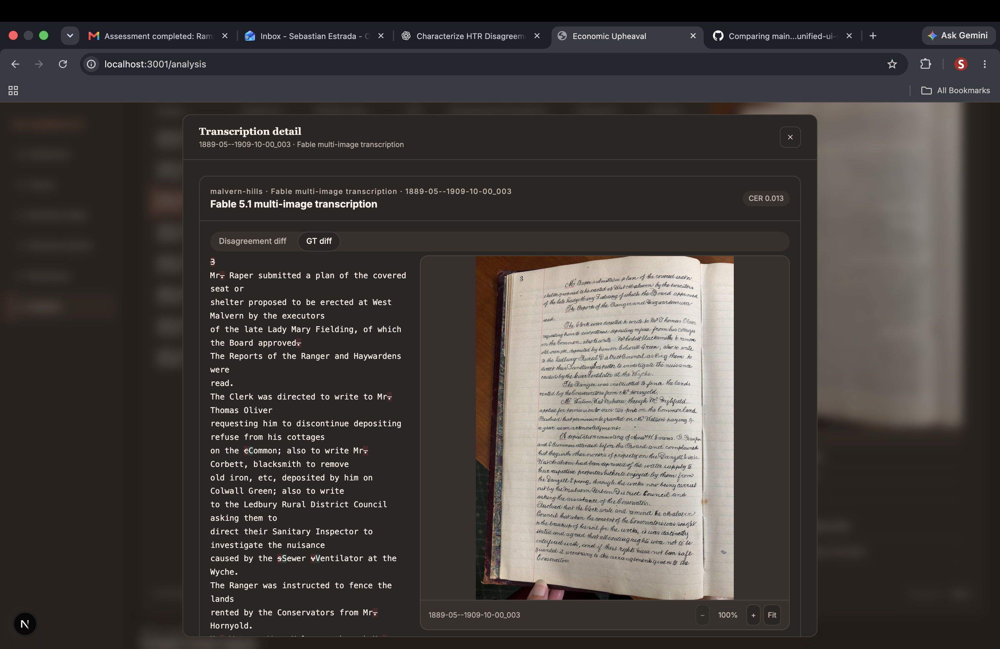
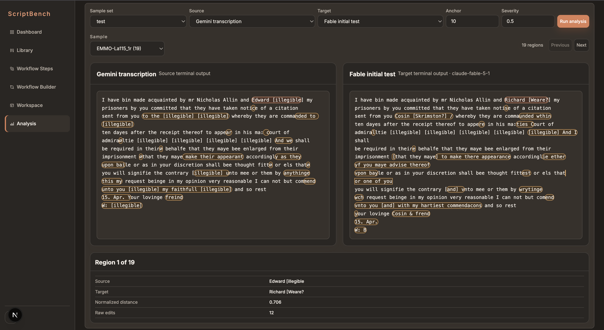
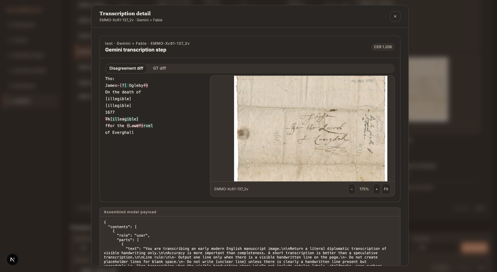

# ScriptBench

ScriptBench is a platform for constructing, running, and evaluating composable
handwritten text recognition (HTR) pipelines for historical documents at scale.
It combines research experimentation with durable execution: researchers can
compare transcription pipelines while preserving every input, model response,
failure, and derived result.

Historical collections routinely contain hundreds or thousands of pages with
irregular scripts, marginalia, historical spelling, bleed-through, and poor
contrast. Established platforms such as
[eScriptorium](https://escriptorium.readthedocs.io/en/latest/) and
[Transkribus](https://help.transkribus.org/beginners-guide-to-transkribus)
support segmentation and trained text-recognition models; conventional OCR and
multimodal language models offer additional approaches. Each performs differently, and useful transcription often requires several preprocessing, classification, correction, and evaluation stages. ScriptBench provides the orchestration and evidence layer for composing those stages into reproducible experiments.

## Why durable execution matters

ScriptBench grew from a practical failure: a malformed JSON response near the end
of a script invalidated almost 100 completed Gemini requests because intermediate
results had not been persisted. Re-running the experiment cost time and model
calls that had already succeeded.

The platform now provides:

- **Composable workflows:** reusable steps connected as validated directed
  acyclic graphs (DAGs), with dependency-aware execution.
- **Durable attempts:** every assembled model payload, raw response, parsed
  response, validation error, and execution time is stored before a result is
  published.
- **Retryability:** failed and completed jobs can be retried independently, with
  append-only attempt history and explicit retry, skip, and abort controls.
- **Idempotent materialization:** a workflow resolves once into uniquely keyed
  jobs, and each job can publish only one output per target artifact.
- **Bounded concurrency:** the execution worker processes many independent jobs
  concurrently while enforcing a configurable limit.
- **Failure visibility:** live WebSocket events stop the affected workflow and
  present the failed job and message for acknowledgement.
- **Provenance:** outputs remain linked to their workflow, step, execution job,
  source artifact, raw attempt, model configuration, and assembled payload.
- **Validated publication:** raw provider responses are retained even when they
  fail JSON or output-schema validation; only valid outputs are published.
- **Restart recovery:** jobs interrupted while running are returned to a pending
  state without discarding their persisted history.

External model calls are not claimed to be exactly-once. ScriptBench protects its
own job and output records from duplication and preserves the evidence needed to
inspect or retry an interrupted request.

## Artifact model

ScriptBench organizes source material into three first-class artifacts:

```text
Document
└── Sample (page image)
    └── Derivative (crop or transformed image)
```

- A **document** is an ordered collection of pages.
- A **sample** is an individual page image, with optional ground truth.
- A **derivative** is a preprocessing output derived from a sample, such as a
  contrast-enhanced image or a segmented line crop.

Folder uploads infer these relationships from filenames:

| Artifact | Convention |
| --- | --- |
| Document | `document.pdf` |
| Page | `document_page.png` |
| Derivative | `document_page_derivative.png` |
| Documentless page | `_page.png` |
| Documentless derivative | `_page_derivative.png` |
| Ground truth | `document_page_gt.txt` or `_page_gt.txt` |



## Workflow model

The smallest unit of work is a **workflow step**, defined by an execution scope, an executor, a method, the runtime configuration (arguments) corresponding to that method, a payload template, and an output scope

The execution scope determines what becomes one model request. The output scope
determines which artifacts receive the result. Both support six granularities:

| Scope | Unit |
| --- | --- |
| `documents` | One document |
| `documents_batch` | All documents in one job |
| `samples` | One page |
| `samples_batch` | The pages belonging to one document |
| `derivatives` | One derivative |
| `derivatives_batch` | The derivatives belonging to one page |

This separation allows, for example, all line crops from a page to be submitted
together while publishing one final transcription for the source page.

The Workflow Builder validates graph structure and dependencies. Workflows can run
continuously along available end-to-end paths or stage by stage according to
topological depth. Individual stages can be held or released.



### From workflow DAG to execution jobs

```text
        ┌─→ 4 ─→ 5
        ├─→ 3 ─→┘
1 ──────└─→ 2
```

Finalizing a workflow resolves its authored DAG into a durable execution graph:

1. Each node's execution scope expands the selected sample set into independently
   schedulable jobs.
2. Artifact lineage maps parent jobs to the downstream jobs that depend on them.
3. Topological depth defines execution stages, and joins wait until every related
   parent job has completed.
4. Completed jobs release eligible children. Continuous mode prioritizes the
   deepest ready work, while stage-by-stage mode completes an entire depth before
   advancing.
5. A step's output scope publishes canonical outputs for downstream steps. Raw
   attempts remain separate, and invalid attempts are never used as dependencies.

Batch requests and responses are keyed by stable artifact IDs so inputs, outputs,
and provenance remain aligned across every transition.



## Research workflow

1. **Manage artifacts:** upload documents, pages, derivatives, and ground truth;
   organize pages into sample sets and derivatives into reusable groups.
2. **Construct a pipeline:** define model steps and compose them on the workflow
   canvas.
3. **Execute and inspect:** queue selected jobs, monitor their lifecycle, inspect
   resolved prompts and raw responses, and retry or acknowledge failures.
4. **Analyze results:** search outputs across workflows, compare CER and WER, and
   inspect localized disagreements between steps to identify where a pipeline
   improved or degraded a transcription.



## Results

The latest development comparison uses the 98-page Malvern Hills sample set and
submits every page from a document in one multi-image request. Gemini currently
has scored outputs for all 98 pages; Fable has 82. To avoid comparing different
page subsets, the metrics below are calculated only across the 82 pages scored by
both workflows. Lower scores are better.

| Workflow | Model | Shared pages | Mean CER | Median CER | Mean WER | Median WER |
| --- | --- | ---: | ---: | ---: | ---: | ---: |
| Fable multi-image | `claude-fable-5-1` | 82 | **0.0307** | **0.0214** | 0.1121 | 0.0937 |
| Gemini multi-image | `gemini-3.1-flash-lite` | 82 | 0.0542 | 0.0407 | **0.1092** | **0.0785** |

On the paired subset, Fable reduced mean CER by 43.3% and achieved lower CER on
73 of 82 pages. Word-level performance was mixed: Gemini's mean WER was 2.6%
lower, with lower WER on 47 pages versus 30 for Fable and five ties. The result
suggests that Fable's character-level improvements do not uniformly translate to
better word boundaries. These remain development results from one collection,
not a general model leaderboard.





## Architecture

- A Next.js frontend provides artifact management, workflow construction,
  execution controls, and analysis.
- A FastAPI backend resolves workflow graphs, validates provider outputs, computes
  CER/WER, and serves live job events.
- PostgreSQL is the durable source of truth for artifacts, workflows, execution
  state, raw attempts, outputs, and provenance. Local non-Docker development can
  use SQLite.
- An in-process asynchronous worker currently claims database-backed jobs and runs
  up to 20 concurrently.

## Run locally

Requirements: Docker Compose and, for live model execution, `GEMINI_API_KEY`
and/or `ANTHROPIC_API_KEY`.

```bash
docker compose -f docker-compose-dev.yml up --build
```

- Application: <http://127.0.0.1:3001>
- API: <http://127.0.0.1:8000>

Compose starts PostgreSQL, applies Alembic migrations, and starts the backend and
frontend. It defaults to development mode with the stub executor enabled, so the
interface can be exercised without spending provider credits. Use the development
controls in the navigation bar to enable real providers.

To stop the stack:

```bash
docker compose -f docker-compose-dev.yml down
```

Persistent database and frontend build data remain in Docker volumes.
